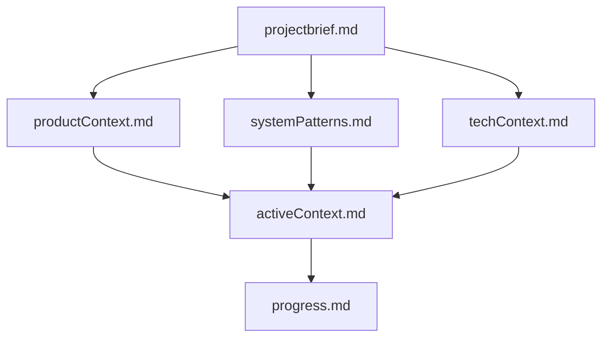

# ClipForge Memory Bank

This directory contains the project's memory bank - a structured documentation system that ensures continuity and clarity throughout development.

## Purpose

The Memory Bank serves as:
- **Project knowledge base**: Complete understanding of goals, architecture, and decisions
- **Onboarding documentation**: Quick ramp-up for new developers or context resets
- **Decision log**: Historical record of why things are the way they are
- **Progress tracker**: Clear view of what's done and what's next

## File Structure

### Core Files (Required)

These files form the foundation of project understanding:

```
memory-bank/
├── projectbrief.md      # What we're building and why (foundation)
├── productContext.md    # User needs and product vision
├── systemPatterns.md    # Architecture and technical patterns
├── techContext.md       # Technologies, tools, and setup
├── activeContext.md     # Current work and immediate focus
└── progress.md          # Status tracking and what's left
```

### File Dependencies



## File Descriptions

### projectbrief.md
**The Foundation Document**
- Project identity and mission
- Core success criteria
- Scope boundaries (in/out of scope)
- Technical approach summary
- Key constraints and risks

**Read this first** - it shapes everything else.

### productContext.md
**Why This Exists**
- Problem being solved
- Target users and use cases
- User workflows
- Experience goals
- Design principles
- Quality standards

**For understanding**: What users need and how they'll use it.

### systemPatterns.md
**How It Works**
- High-level architecture
- Component organization
- State management patterns
- Key technical patterns (FFmpeg, video sync, timeline, etc.)
- File system organization
- Error handling strategies
- Performance optimizations

**For implementation**: Technical patterns and architectural decisions.

### techContext.md
**Tools and Technologies**
- Complete technology stack
- Development environment setup
- Dependencies and versions
- Configuration files
- Build and deployment process
- Known limitations
- Technical debt tracking

**For setup and development**: Everything needed to work on the project.

### activeContext.md
**Current Focus**
- What we're doing now
- Recent changes
- Immediate next steps
- Active decisions and open questions
- Current challenges
- Implementation strategy
- Blockers

**Most frequently updated** - reflects current state of work.

### progress.md
**Status Tracking**
- What's working
- What's not working yet
- Feature-by-feature status
- Implementation progress by area
- Known issues
- Testing status
- Build and packaging status
- Risk assessment
- Next milestones

**For tracking**: Complete view of project progress.

## How to Use This Memory Bank

### At the Start of Each Session
1. **Read activeContext.md** - Understand current focus
2. **Check progress.md** - See what's done and what's next
3. **Reference other files** - As needed for specific context

### During Work
- **Update activeContext.md** - When focus changes
- **Update progress.md** - When features complete or status changes
- **Reference systemPatterns.md** - When implementing technical patterns
- **Reference techContext.md** - For setup or tool questions

### After Significant Changes
- **Update activeContext.md** - Document new decisions or challenges
- **Update progress.md** - Mark completed work, update status
- **Update systemPatterns.md** - If patterns evolve
- **Update techContext.md** - If tools or setup changes

### When Requesting "Update Memory Bank"
Review **ALL** files, even those not requiring changes. Focus particularly on:
- **activeContext.md** - Always update with current state
- **progress.md** - Always update with latest status
- Other files as appropriate

## Memory Bank Maintenance

### Update Frequency

**Every Session**:
- activeContext.md (current focus)
- progress.md (status updates)

**As Needed**:
- systemPatterns.md (when patterns emerge or change)
- techContext.md (when tools or setup changes)

**Rarely**:
- projectbrief.md (only if fundamental scope changes)
- productContext.md (only if product direction shifts)

### Quality Guidelines

1. **Be Specific**: Concrete details over vague descriptions
2. **Be Current**: Reflect actual state, not aspirational
3. **Be Actionable**: Include next steps and clear decisions
4. **Be Honest**: Document challenges and unknowns
5. **Be Concise**: Clear and scannable, not exhaustive prose

## Additional Context Files

As the project grows, you may add:
- Feature-specific documentation
- API specifications
- Testing strategies
- Deployment procedures
- Integration guides

Create new files as needed, but maintain the core structure.

## Related Documentation

- **PRD** (`../clip-forge-prd.md`): Comprehensive product requirements
- **Task List** (`../clip-forge-task-list.md`): Detailed implementation checklist
- **README** (`../README.md`): User-facing project documentation
- **Rules** (`../.cursor/rules/`): Project-specific AI rules and patterns

---

**Memory Bank Version**: 1.0  
**Initialized**: Project Start  
**Status**: Active and Ready

